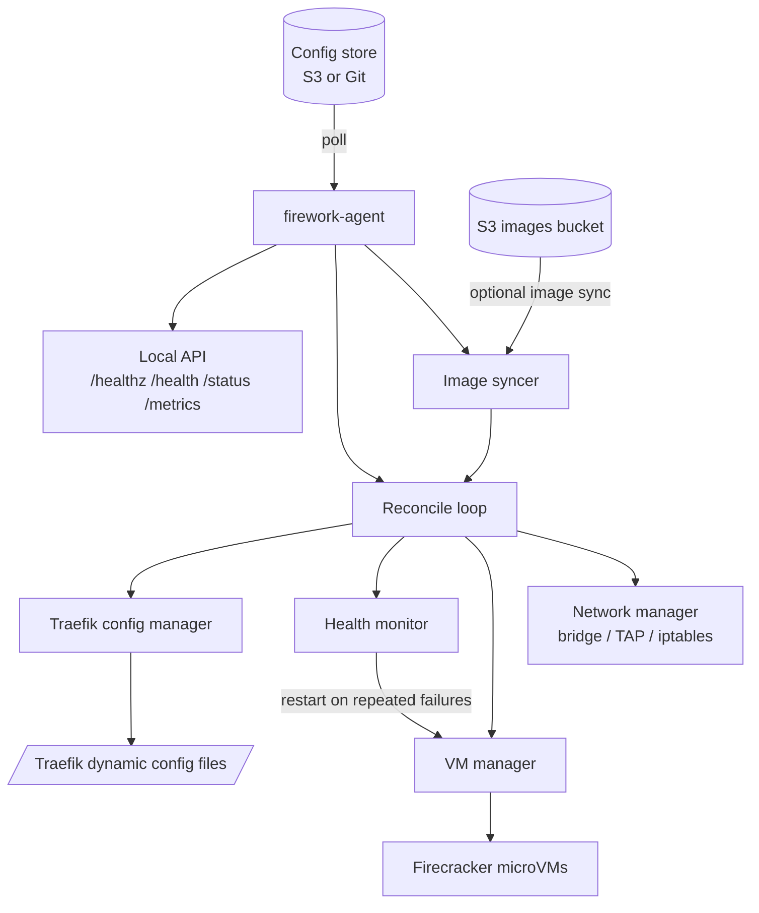

# 

A lightweight, pull-based orchestrator for services running in [Firecracker](https://firecracker-microvm.github.io/) microVMs.

## Related Repositories

- [firework-deployment-example](https://github.com/artemnikitin/firework-deployment-example) - Terraform + Packer deployment on AWS
- [firework-gitops-example](https://github.com/artemnikitin/firework-gitops-example) - example GitOps input repo and rootfs image build pipeline

## What Firework Includes

- `firework-agent` (node runtime): pulls desired state from Git or S3 and reconciles local Firecracker VMs.
- `enricher` (Lambda): converts user-friendly service specs into resolved per-node configs.
- `scheduler` (Lambda): performs node placement using capacity information.

## How It Works



## Documentation

- Architecture: [`docs/architecture/README.md`](docs/architecture/README.md)
- Configuration reference: [`docs/configs/README.md`](docs/configs/README.md)
- Example agent configs: [`examples/`](examples/)

## Quick Start

Prerequisites:

- Linux host with KVM (`/dev/kvm`)
- Firecracker binary installed
- Go 1.25+ (for building from source)

Build binaries:

```bash
make build-all
```

Run agent with an example config:

```bash
sudo ./bin/firework-agent --config examples/agent-s3.yaml
```

## Deployment Modes

- **Recommended:** GitOps input -> enricher -> S3 `nodes/*.yaml` -> agent polls S3.
- **Simple mode:** agent pulls fully resolved `nodes/*.yaml` directly from Git (no enricher/scheduler).

## License

MIT
