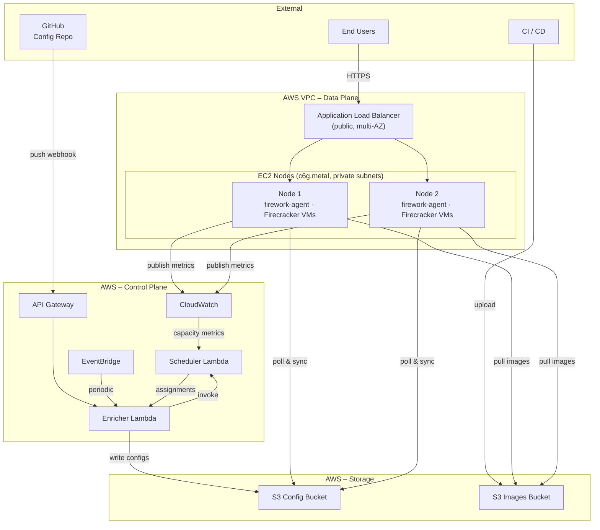

# 

A lightweight, pull-based orchestrator for services running in [Firecracker](https://firecracker-microvm.github.io/) microVMs.

## Related Repositories

You can use them to have everything working end-to-end:

- [firework-deployment-example](https://github.com/artemnikitin/firework-deployment-example) - Terraform + Packer deployment on AWS
- [firework-gitops-example](https://github.com/artemnikitin/firework-gitops-example) - example GitOps input repo and rootfs image build pipeline

## How It Works

The diagram below shows an example deployment: two EC2 bare-metal nodes running inside a private VPC, fronted by an ALB, with a GitOps-driven control plane built from two Lambdas, an S3 config bucket, and CloudWatch for observability.

## Documentation

- Architecture overview: [`docs/architecture/README.md`](docs/architecture/README.md)
- Design decisions and rationale: [`docs/architecture/DESIGN.md`](docs/architecture/DESIGN.md)
- Configuration reference: [`docs/configs/README.md`](docs/configs/README.md)
- Example agent configs: [`examples/`](examples/)
- Development guide: [`DEVELOPMENT.md`](DEVELOPMENT.md)

## License

MIT
