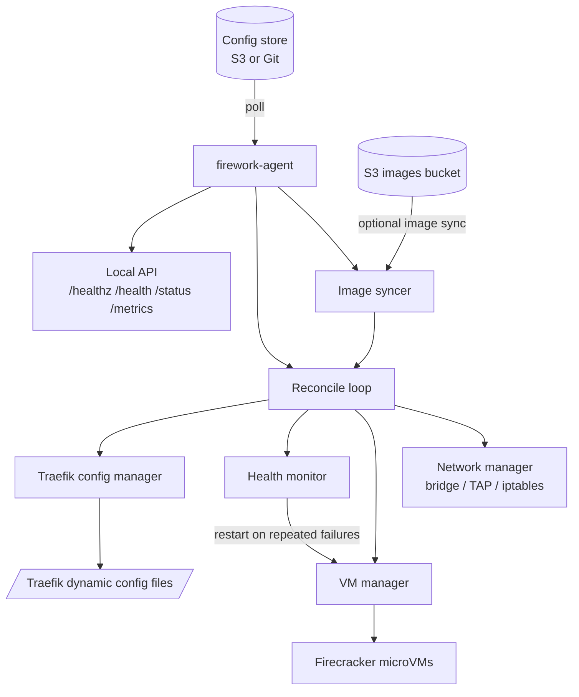
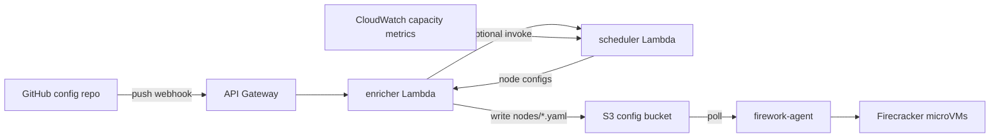

# Firework Architecture

This document explains how Firework components work together at runtime.

## Components

### `firework-agent` (runs on each node)

- Polls a config store (`git` or `s3`) for desired state.
- Reconciles local Firecracker microVMs to match that state.
- Additionally, manages networking, health checks, image sync, and Traefik dynamic routes.
- Exposes local HTTP endpoints (`/healthz`, `/health`, `/status`, `/metrics`).

### `enricher` Lambda

- Receives GitHub push webhooks (or scheduled EventBridge invocations).
- Clones the config repo, loads user-facing specs, applies defaults, validates, and writes `nodes/*.yaml` to S3.
- Optionally calls scheduler Lambda for multi-node placement.

### `scheduler` Lambda

- Discovers active nodes from CloudWatch capacity metrics.
- Preserves stable placement from existing S3 node configs when possible.
- Applies best-fit scheduling with anti-affinity support for remaining services.
- Returns per-node assignments to the enricher.

## Agent Internals

## Recommended Production Flow (S3 Mode)

### Write semantics

- Enricher output is stored as `nodes/<node>.yaml`.
- Stale `nodes/*.yaml` files are deleted when no longer part of desired output.
- Empty scheduler output does not trigger destructive cleanup (guarded no-op write path).

## Agent Reconciliation Pipeline

Per poll interval, the agent executes roughly this sequence:

1. Fetch desired config(s) for this node label set (`node_names`).
2. Merge services from all fetched configs (deterministic ordering by service name).
3. Optionally skip work when revision is unchanged (single-label optimization).
4. Assign networking data (guest IP/MAC) for networked services.
5. Resolve service links into env vars (same-node service discovery).
6. Inject env vars into kernel args (`firework.env.KEY=VALUE`).
7. Optionally enforce capacity guardrails before apply.
8. Optionally sync images from S3.
9. Plan/apply VM changes (create/update/delete).
10. Sync Traefik dynamic files.

## Scheduling and Multi-Node Behavior

When scheduler integration is enabled:

- Enricher sends enriched services to scheduler.
- Scheduler reads node capacity metrics and current placement.
- Existing healthy placements are kept where possible.
- Unplaced services are bin-packed to nodes with available capacity.
- `anti_affinity_group` is respected as a preference constraint.

If the enricher can resolve EC2 private IPs for scheduled nodes:

- `cross_node_links` are expanded to env vars like `<host_ip>:<host_port>`.
- `node_host_ip_env` is injected with the service's host node IP.

## Networking and Traffic Model

- Firework can create a shared bridge and TAP interfaces for VM networking.
- Guest IPs are assigned deterministically from `vm_subnet`.
- Host-to-guest exposure uses DNAT rules from `port_forwards`.
- Same-node service discovery uses runtime-resolved guest IPs (links).
- For cross-node proxying, Traefik sync can include peer-node services when the store supports listing all node configs.

## Alternative Flow: Direct Git Mode

You can run without enricher/scheduler:

- Store fully resolved `nodes/*.yaml` directly in Git.
- Configure agent with `store_type: git`.
- Agent pulls and reconciles directly from that repo.

This is simpler operationally, but you manage full per-node configs yourself.

## See Also

- Design decisions and rationale: [`DESIGN.md`](DESIGN.md)
- Main overview: [`../../README.md`](../../README.md)
- Config reference: [`../configs/README.md`](../configs/README.md)
