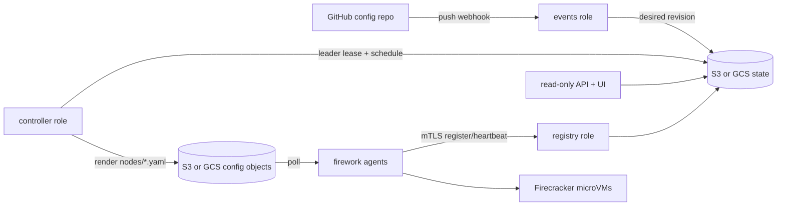

# Firework Architecture

This document explains how Firework components work together at runtime.

## Components

### `firework-agent` (runs on each node)

- Polls S3 or GCS (or Git in direct mode) for desired `nodes/<node>.yaml`.
- Reconciles local Firecracker microVMs to match desired state.
- Manages networking, health checks, image sync, and Traefik dynamic routes.
- Registers with control plane and sends periodic heartbeat over mTLS.
- Exposes local HTTP endpoints (`/healthz`, `/health`, `/status`, `/metrics`).

### `firework-controlplane` (single binary, role-based runtime)

Roles:

- `registry`: node enrollment (bootstrap token + CSR), register, heartbeat, node-state APIs.
- `events`: GitHub webhook ingestion, repo clone, enrichment, desired revision publishing.
- `controller`: leader-elected scheduler/publisher loop.
- `api`: authenticated read-only node/service API and embedded web UI.
- `all`: runs all roles in one process.

All roles use the same object-storage-backed state layout under `cp/v1/`.
The configured backend can be S3 or GCS.

## Control-Plane State Model (Object Storage)

- `cp/v1/registry/nodes/<node>.json` — node records (state, generation,
  capacity, last seen, and optional bounded agent status).
- `cp/v1/desired/revisions/<rev>.json` + `cp/v1/desired/current.json`.
- `cp/v1/placements/revisions/<rev>.json` + `cp/v1/placements/current.json`.
- `cp/v1/rendered/revisions/<rev>/nodes/<node>.yaml` + `cp/v1/rendered/current.json`.
- `cp/v1/nodes/<node>.yaml` — current per-node configs polled by agents.
- `cp/v1/locks/controller.json` — controller leader lease.

The controller writes immutable revisions and flips pointer files atomically.

## Recommended Production Flow (Object Storage Mode)

```mermaid
flowchart LR
  GH[GitHub config repo] -->|push webhook| EV[events role]
  EV -->|desired revision| STATE[(S3 or GCS state)]
  AGENTS[firework agents] -->|mTLS register/heartbeat| REG[registry role]
  REG --> STATE
  CTRL[controller role] -->|leader lease + schedule| STATE
  CTRL -->|render nodes/*.yaml| CFG[(S3 or GCS config objects)]
  API[read-only API + UI] --> STATE
  CFG -->|poll| AGENTS
  AGENTS --> FC[Firecracker microVMs]
```

## Agent Reconciliation Pipeline

Per poll interval, the agent executes roughly this sequence:

1. Fetch desired config(s) for this node label set (`node_names`).
2. Merge services from all fetched configs (deterministic ordering by service name).
3. Optionally skip work when revision is unchanged (single-label optimization).
4. Assign networking data (guest IP/MAC) for networked services.
5. Resolve service links into env vars (same-node service discovery).
6. Inject env vars into kernel args (`firework.env.KEY=VALUE`).
7. Optionally enforce capacity guardrails before apply.
8. Optionally sync images from S3 or GCS.
9. Plan/apply VM changes (create/update/delete).
10. Sync Traefik dynamic files.
11. Publish one bounded status snapshot to local `/status` and registry
    heartbeat (capacity, desired usage, revisions, conditions, service state).

## Scheduling and Multi-Node Behavior

- Controller discovers active nodes from registry records (`state=ready`, fresh lease).
- Existing placements on active nodes are preserved when capacity and
  anti-affinity allow.
- Unplaced services are bin-packed to nodes with available capacity.
- `anti_affinity_group` is treated as a preference.
- `node_type` is retained by the enricher for direct per-label output, but the
  current control-plane scheduler does not enforce it against registry labels;
  see [issue #21](https://github.com/artemnikitin/firework/issues/21).
- `cross_node_links` and `node_host_ip_env` are resolved from registry host IPs.
  A cross-node link keeps the legacy bare `host_ip:host_port` value unless its
  optional `protocol` is set, in which case the controller injects a full URL.
  Links sharing the same env key are comma-joined in spec order.
- Agents using a store that can list peer node configs, such as S3 or GCS, also
  write remote Traefik configs so any node can proxy routed services scheduled
  on peer nodes.

## Alternative Flow: Direct Git Mode

You can still run without control plane:

- Store fully resolved `nodes/*.yaml` directly in Git.
- Configure agent with `store_type: git`.
- Agent pulls and reconciles directly from that repo.

## See Also

- Design decisions and rationale: [`DESIGN.md`](DESIGN.md)
- Main overview: [`../../README.md`](../../README.md)
- Config reference: [`../configs/README.md`](../configs/README.md)
- Deployment visibility API, CLI, and UI: [`../deployment-visibility.md`](../deployment-visibility.md)
